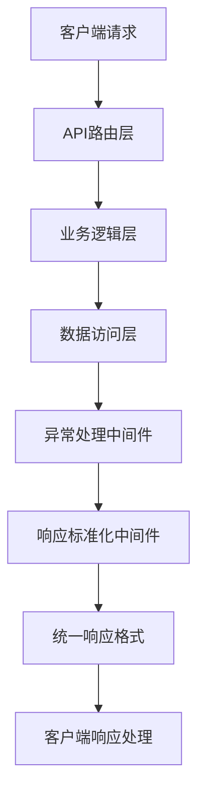
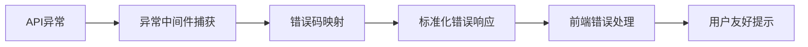
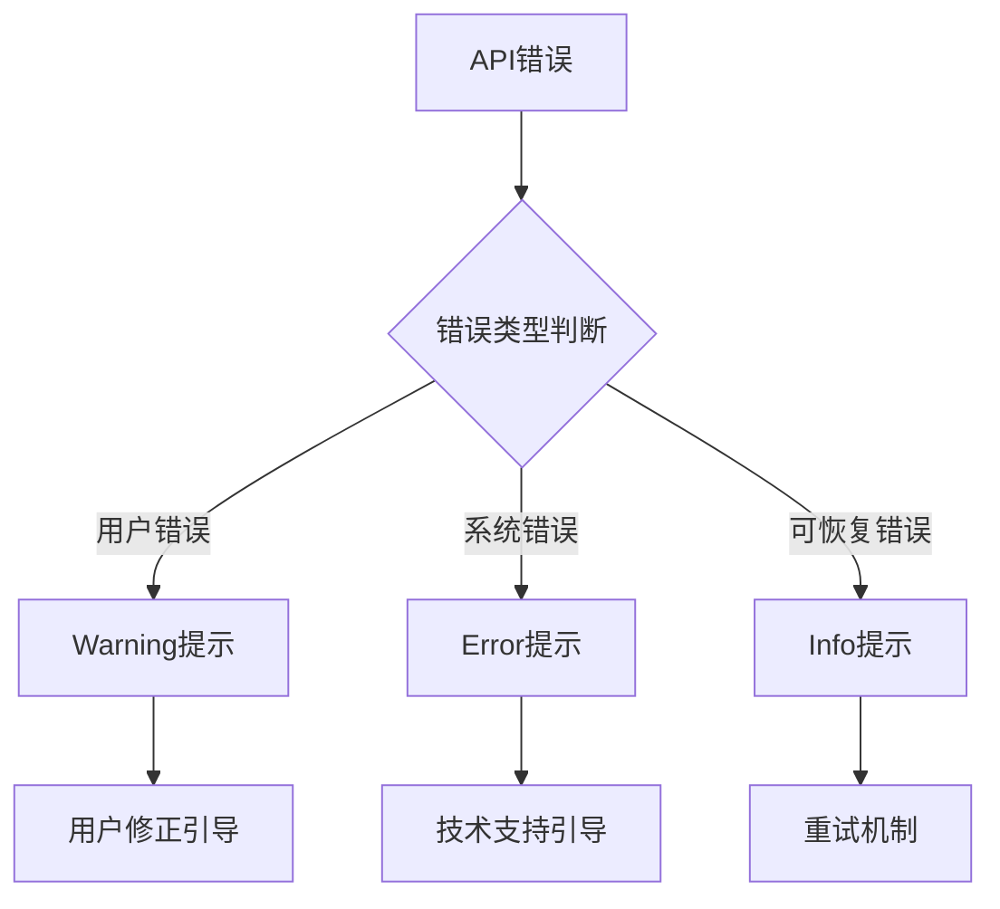
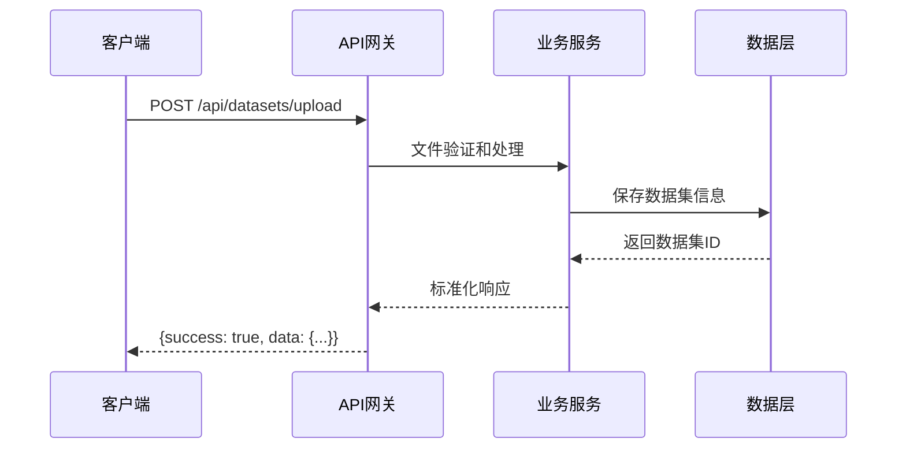
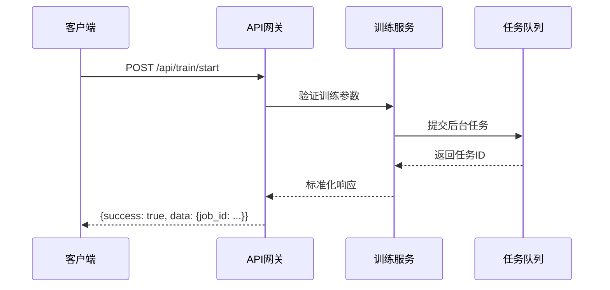

# API接口标准化审查和改进设计文档

## 项目概述

本文档旨在对LLM Trainer MVP项目进行API接口标准化审查和前后端逻辑一致性检查，确保系统具有统一的接口规范、一致的数据格式和可靠的错误处理机制。

## 技术栈

- **后端**: FastAPI + Python 3.x + Pydantic
- **前端**: Vue 3 + Axios + Element Plus
- **架构**: 前后端分离架构

## 当前状态分析

### 1. 现有API响应格式

后端使用统一的响应格式：
```json
{
  "success": true,
  "code": 200,
  "message": "操作成功",
  "data": {...}
}
```

### 2. 前端API服务层
- 使用`handleResponse`函数统一处理API响应
- 实现错误码映射系统
- 配置了axios拦截器

### 3. 识别的问题

#### API接口标准化问题
1. **响应格式不一致**: 部分API直接返回data，部分返回完整结构
2. **错误处理机制不统一**: HTTPException与APIResponse混用
3. **状态码使用不规范**: 错误状态码映射不完整
4. **缺少标准化中间件**: 没有全局异常处理中间件

#### 前后端一致性问题
1. **数据格式兼容性**: 前端组件期望格式与后端返回格式不匹配
2. **错误码同步**: 前后端错误码定义不完全同步
3. **参数命名不一致**: API参数命名约定不统一
4. **响应数据处理逻辑**: 前端对不同API响应格式处理逻辑复杂

## 标准化改进架构

### 1. API响应标准化架构



### 2. 错误处理流程



## 具体改进方案

### 1. 后端API标准化改进

#### 1.1 全局异常处理中间件

```python
# 新增：app/core/exception_handler.py
@app.exception_handler(APIException)
async def api_exception_handler(request: Request, exc: APIException):
    return APIResponse.json_response(
        success=False,
        message=exc.message,
        code=exc.error_code.code,
        data=exc.data,
        status_code=exc.status_code
    )
```

#### 1.2 统一API响应装饰器

```python
# 新增：app/core/decorators.py
def standardized_response(func):
    @wraps(func)
    async def wrapper(*args, **kwargs):
        try:
            result = await func(*args, **kwargs)
            if isinstance(result, dict) and 'success' in result:
                return result  # 已经是标准格式
            return APIResponse.success(data=result)
        except APIException as e:
            raise e
        except Exception as e:
            logger.error(f"Unexpected error: {str(e)}")
            raise InternalServerException(message=str(e))
    return wrapper
```

#### 1.3 API路由改进

| 端点 | 当前问题 | 改进方案 |
|------|---------|---------|
| `POST /api/datasets/upload` | 错误处理不统一 | 使用标准异常类 |
| `GET /api/datasets` | 响应格式不一致 | 应用统一装饰器 |
| `GET /api/datasets/{id}/preview` | 参数验证缺失 | 增加Pydantic验证 |
| `POST /api/train/start` | 导入错误 | 修正TrainingService导入 |
| `POST /api/predict` | 缺少输入验证 | 增强请求验证 |

### 2. 前端一致性改进

#### 2.1 API服务层重构

```javascript
// 改进：services/api.js
const handleResponse = (promise) => {
  return promise.then(response => {
    // 统一处理各种响应格式
    if (response?.success === true) {
      return response.data || response;
    } else if (response?.success === false) {
      return Promise.reject(response);
    } else {
      // 处理非标准格式响应
      return response?.data || response;
    }
  });
};
```

#### 2.2 数据格式适配器

```javascript
// 新增：services/adapters.js
export const datasetAdapter = {
  // 适配数据集列表响应
  adaptDatasetList(response) {
    if (Array.isArray(response)) return response;
    if (response?.data && Array.isArray(response.data)) return response.data;
    return [];
  },
  
  // 适配预览数据响应
  adaptPreviewData(response) {
    if (response?.preview) return response.preview;
    if (response?.data?.preview) return response.data.preview;
    if (Array.isArray(response)) return response;
    return [];
  }
};
```

### 3. 错误码同步优化

#### 3.1 错误码定义一致性

| 功能模块 | 后端错误码 | 前端映射 | 同步状态 |
|---------|-----------|---------|---------|
| 数据集管理 | 20001-20004 | ✓ 已同步 | 完整 |
| 训练管理 | 30001-30004 | ✓ 已同步 | 完整 |
| 预测功能 | 40001-40003 | ✓ 已同步 | 完整 |
| 系统错误 | 50001-50004 | ✓ 已同步 | 完整 |

#### 3.2 错误处理策略



## 接口规范标准

### 1. 请求规范

- **Content-Type**: `application/json`
- **参数命名**: 使用snake_case风格
- **必填参数**: 使用Pydantic Field验证
- **查询参数**: 统一使用Query参数验证

### 2. 响应规范

```typescript
interface APIResponse<T> {
  success: boolean;
  code: number;
  message: string;
  data?: T;
  timestamp?: string;
}
```

### 3. 错误响应规范

```typescript
interface ErrorResponse {
  success: false;
  code: number;
  message: string;
  data?: any;
  timestamp: string;
}
```

## 数据流标准化

### 1. 数据集管理流程



### 2. 训练任务流程



## 测试策略

### 1. API标准化测试

- **响应格式一致性测试**: 验证所有API返回标准格式
- **错误处理测试**: 验证异常场景返回正确错误码
- **参数验证测试**: 验证输入参数校验逻辑

### 2. 前后端集成测试

- **数据格式兼容性测试**: 验证前端能正确处理后端响应
- **错误处理集成测试**: 验证前端错误提示与后端错误码匹配
- **用户体验测试**: 验证错误提示的用户友好性

### 3. 性能测试

- **响应时间测试**: 验证标准化改进不影响性能
- **并发处理测试**: 验证异常处理中间件的稳定性
- **内存使用测试**: 验证统一响应格式的内存效率

## 监控和维护

### 1. API监控指标

- **响应格式一致性率**: 监控非标准响应的比例
- **错误码覆盖率**: 监控未映射错误码的出现频率
- **API响应时间**: 监控标准化后的性能表现

### 2. 代码质量保证

- **Lint规则**: 配置ESLint和Pylint规则确保代码规范
- **类型检查**: 使用TypeScript和Pydantic确保类型安全
- **代码审查**: 建立PR审查流程确保标准遵循

## 实施计划

### 阶段一：后端标准化 (3天)
1. 实现全局异常处理中间件
2. 修复现有API路由问题
3. 统一错误处理机制

### 阶段二：前端适配 (2天)
1. 重构API服务层
2. 实现数据格式适配器
3. 优化错误处理逻辑

### 阶段三：集成测试 (2天)
1. 编写API标准化测试
2. 执行前后端集成测试
3. 性能和稳定性验证

### 阶段四：监控部署 (1天)
1. 配置监控指标
2. 部署到测试环境
3. 文档更新和培训