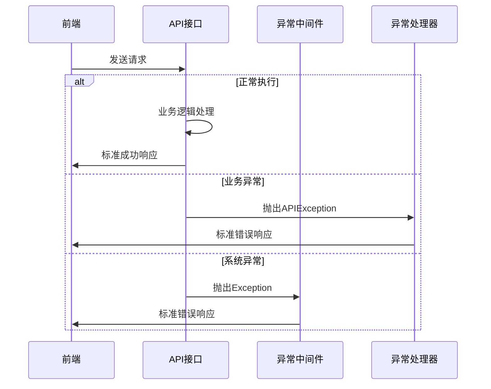
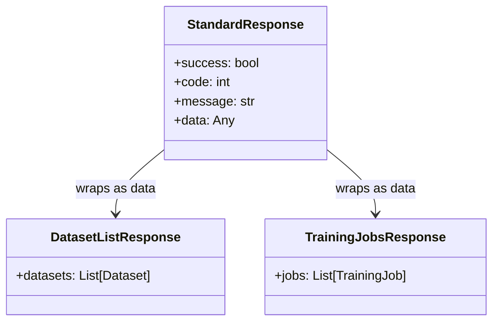
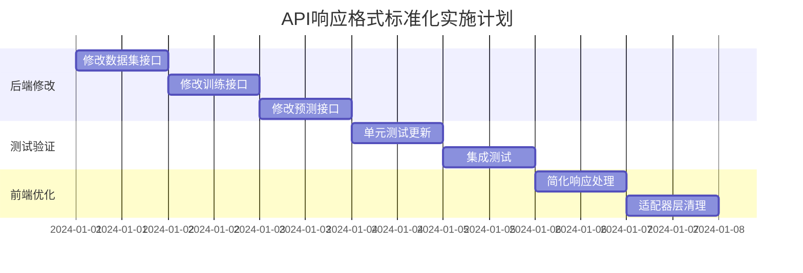

# T-07统一异常与日志任务检查与优化设计

## 1. 概述

本文档旨在检查T-07"统一异常与日志"任务的执行情况，识别后端API响应格式不一致的问题，并提供优化方案。经过初步分析，发现虽然项目已建立了统一响应格式的基础设施，但在实际API实现中存在格式不一致的问题。

## 2. 问题分析

### 2.1 已实现的标准化基础设施

项目已经建立了完整的响应标准化基础设施：

```
app/core/response.py      - APIResponse统一响应类
app/core/exception_handler.py - 全局异常处理器
app/core/decorators.py    - @standardized_response装饰器
app/core/errors.py        - 统一错误码定义
```

标准响应格式定义为：
```json
{
  "success": true/false,
  "code": 200,
  "message": "操作成功/失败信息",
  "data": "实际数据"
}
```

### 2.2 发现的API响应格式不一致问题

| API接口 | 当前响应格式 | 问题描述 | 是否使用装饰器 |
|---------|-------------|----------|---------------|
| `GET /datasets` | 直接返回列表 | 未包装标准格式 | ❌ |
| `GET /train/jobs` | 直接返回列表 | 未包装标准格式 | ❌ |
| `POST /train/start` | 直接返回TrainingResponse对象 | 未包装标准格式 | ❌ |
| `GET /train/status/{job_id}` | 直接返回TrainingStatusResponse对象 | 未包装标准格式 | ❌ |
| `POST /predict` | 直接返回PredictionResponse对象 | 未包装标准格式 | ❌ |
| `GET /health` | 使用APIResponse.success() | ✅ 标准格式 | ❌ |
| `POST /datasets/upload` | 使用@standardized_response | ✅ 标准格式 | ✅ |
| `POST /train/stop` | 使用@standardized_response | ✅ 标准格式 | ✅ |

### 2.3 前端兼容性处理分析

前端在`api.js`中的`handleResponse`函数已经实现了多种格式的兼容处理：

```javascript
// 处理标准格式: { success: true, data: [...] }
// 处理直接返回数组: [...]
// 处理直接返回对象: { ... }
```

虽然前端有兼容处理，但这种不一致性会导致：
1. 代码维护复杂度增加
2. 错误处理逻辑不统一
3. API文档和调试困难
4. 未来扩展性受限

## 3. 优化方案架构

### 3.1 响应格式标准化策略

```mermaid
graph TD
    A[API接口] --> B{使用装饰器?}
    B -->|是| C[@standardized_response]
    B -->|否| D[直接返回数据]
    
    C --> E[标准格式响应]
    D --> F[非标准格式响应]
    
    E --> G[前端统一处理]
    F --> H[前端兼容处理]
    
    I[优化方案] --> J[统一使用装饰器]
    I --> K[更新响应模型]
    I --> L[前端处理简化]
```

### 3.2 API响应格式分类处理

| 数据类型 | 处理策略 | 装饰器使用 | 响应格式 |
|----------|----------|-----------|----------|
| 列表数据 | 包装为data字段 | ✅ | `{success: true, data: [...]}` |
| 对象数据 | 包装为data字段 | ✅ | `{success: true, data: {...}}` |
| 操作结果 | 直接使用装饰器 | ✅ | `{success: true, message: "..."}` |
| 健康检查 | 使用APIResponse类 | ❌ | `{success: true, data: {...}}` |

### 3.3 错误处理统一化



## 4. 具体优化实施方案

### 4.1 后端API接口修改清单

**需要修改的接口:**

1. **数据集相关接口**
   - `GET /datasets` - 添加@standardized_response装饰器
   - 移除注释中的装饰器，确保返回标准格式

2. **训练相关接口**
   - `POST /train/start` - 修改为使用@standardized_response
   - `GET /train/status/{job_id}` - 添加@standardized_response装饰器
   - `GET /train/jobs` - 添加@standardized_response装饰器

3. **预测相关接口**
   - `POST /predict` - 添加@standardized_response装饰器

### 4.2 响应模型更新策略



### 4.3 装饰器使用规范

**装饰器应用原则:**
1. 所有返回业务数据的接口使用`@standardized_response`
2. 健康检查等系统接口直接使用`APIResponse.success()`
3. 错误情况统一通过异常处理器处理

**装饰器配置示例:**
```python
@router.get("", response_model=dict)
@standardized_response("获取数据集列表成功")
async def list_datasets():
    datasets = await dataset_service.get_all_datasets()
    return datasets  # 装饰器自动包装为标准格式
```

### 4.4 前端处理优化

**简化handleResponse函数:**
```javascript
const handleResponse = (promise) => {
  return promise.then(response => {
    // 统一处理标准格式: { success: true, data: [...] }
    if (response.success === true) {
      return response.data || response;
    } else {
      return Promise.reject(response);
    }
  });
};
```

## 5. 实施步骤与测试验证

### 5.1 实施步骤



### 5.2 测试验证方案

**接口响应格式测试:**
```python
def test_api_response_format():
    # 测试所有接口返回标准格式
    assert response.get('success') is not None
    assert response.get('code') is not None
    assert response.get('message') is not None
    assert 'data' in response or response['success'] is False
```

**前后端集成测试:**
- 验证前端能正确解析所有API响应
- 验证错误处理的一致性
- 验证数据适配器的正确性

### 5.3 质量保障措施

1. **代码审查检查点:**
   - 所有业务API必须使用统一响应格式
   - 装饰器使用的一致性
   - 错误处理的完整性

2. **自动化测试:**
   - API响应格式验证测试
   - 错误场景覆盖测试
   - 前端兼容性测试

3. **监控指标:**
   - API响应格式一致性指标
   - 错误处理覆盖率
   - 前端错误处理成功率

## 6. 预期效果

### 6.1 优化后的统一响应格式

**成功响应示例:**
```json
{
  "success": true,
  "code": 200,
  "message": "获取数据集列表成功",
  "data": [
    {
      "id": 1,
      "name": "dataset1.csv",
      "created_at": "2024-01-01T00:00:00Z"
    }
  ]
}
```

**错误响应示例:**
```json
{
  "success": false,
  "code": 40001,
  "message": "数据集不存在",
  "data": null
}
```

### 6.2 提升效果

1. **开发效率提升:** 统一的响应格式减少前端适配代码
2. **维护成本降低:** 标准化的错误处理和响应格式
3. **调试体验改善:** 一致的API响应便于调试和监控
4. **扩展性增强:** 统一格式便于后续功能扩展

## 7. 风险评估与缓解

### 7.1 风险识别

| 风险类型 | 风险描述 | 影响程度 | 缓解措施 |
|----------|----------|----------|----------|
| 兼容性风险 | 前端代码可能依赖现有格式 | 中 | 保持前端兼容处理一段时间 |
| 测试覆盖 | 修改可能引入新的bug | 中 | 完善单元测试和集成测试 |
| 部署风险 | 前后端不同步部署 | 低 | 先部署后端，前端保持兼容 |

### 7.2 回滚策略

如果发现问题，可以：
1. 快速回滚到使用装饰器之前的版本
2. 前端handleResponse函数已有兼容处理，影响较小
3. 分接口逐步修改，降低整体风险

## 8. 后续改进建议

1. **API版本化管理:** 为未来API变更建立版本化机制
2. **响应时间监控:** 添加API响应时间和成功率监控
3. **自动化测试增强:** 建立API契约测试确保格式一致性
4. **文档自动生成:** 基于标准格式自动生成API文档