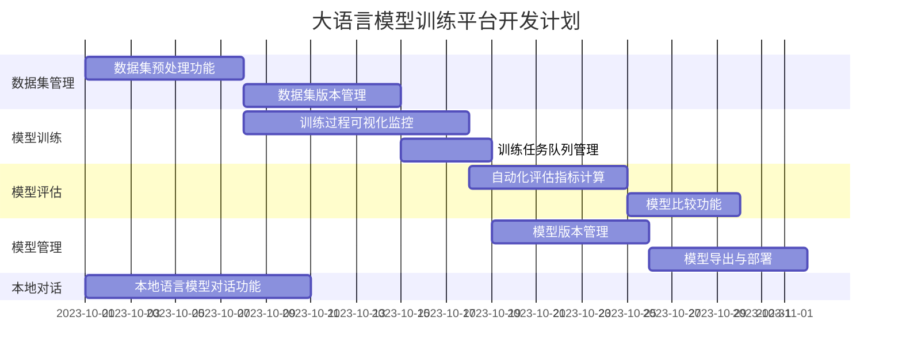

# 大语言模型训练平台前后端协同开发任务文档

## 文档说明

本文档用于跟踪大语言模型训练平台的前后端协同开发任务进度。每个任务都包含详细的前后端工作内容、接口对接规范、测试用例和验收标准，并提供任务状态实时更新机制。

## 使用约定

1. **状态标识**：每个任务使用以下状态标识：
   - `[待开始]` - 任务尚未启动
   - `[进行中]` - 任务正在进行
   - `[已完成]` - 任务已完成并通过验收
   - `[阻塞中]` - 任务因依赖或其他原因被阻塞

2. **更新记录**：每次更新任务状态时，在任务下方的"进度更新"部分添加日期和详细说明。

3. **问题记录**：遇到的问题记录在任务的"问题记录"部分，并标注解决状态。

## 项目概述

大语言模型训练平台是一个基于Web的系统，旨在帮助研究人员和开发者方便地进行模型训练、调优和部署。目前项目已完成基础架构搭建和部分核心功能实现，包括用户认证、数据集管理的基本功能以及训练任务的初步实现。

## 当前项目进度

### 已完成功能

1. **基础架构搭建**
   - 前端：Vue 3 + Element Plus 基础框架
   - 后端：FastAPI + PostgreSQL 基础架构
   - 用户认证系统（登录、注册）

2. **数据集管理**
   - 数据集上传功能
   - 数据集列表查看
   - 数据集预览功能

3. **训练系统**
   - 基础训练配置界面
   - 训练任务创建和状态查询API

### 待完成功能

根据PRD文档，以下是待完成的主要功能模块：

1. **数据集管理系统完善**
   - 数据集预处理功能
   - 数据集版本管理

2. **模型训练系统完善**
   - 训练过程可视化监控
   - 训练日志实时查看
   - 训练任务队列管理

3. **模型评估系统**
   - 自动化评估指标计算
   - 自定义测试集评估
   - 结果可视化展示

4. **模型管理系统**
   - 模型版本控制
   - 模型导出与部署

5. **本地语言模型对话功能**
   - 本地模型加载与推理
   - 对话界面与历史记录
   - 参数调整与模型切换

## 任务总览与依赖



## 协同开发任务详细拆分

### 第一阶段：数据集管理系统完善

#### 任务1.1：数据集预处理功能 `[待开始]`

**目标**：实现数据集的预处理功能，包括文本清洗、分词等操作，提高数据质量。

**前端任务**：
- [ ] 创建数据集预处理配置界面
- [ ] 实现预处理选项（文本清洗、分词等）的UI组件
- [ ] 添加预处理预览功能

**后端任务**：
- [ ] 实现数据集预处理API（`/datasets/{dataset_id}/preprocess`）
- [ ] 开发文本清洗、分词等预处理功能
- [ ] 实现预处理结果存储机制

**接口对接**：
```
POST /api/datasets/{dataset_id}/preprocess
请求体：{
  "options": {
    "clean_text": boolean,
    "tokenize": boolean,
    "remove_stopwords": boolean
  }
}
响应：{
  "status": "success",
  "data": {
    "processed_id": number,
    "original_rows": number,
    "processed_rows": number
  }
}
```

**测试用例**：
1. 上传包含特殊字符的数据集并进行清洗，验证特殊字符是否被正确处理
2. 验证预处理后的数据集是否可以正确预览和使用
3. 测试不同预处理选项组合的效果

**验收标准**：
- 能够成功对上传的数据集进行预处理
- 预处理选项可以灵活配置
- 预处理结果可以预览和下载
- 预处理后的数据集可以用于后续训练

**负责人**：
- 前端：待定
- 后端：待定

**预计耗时**：7天

**优先级**：高

**进度更新**：
- 暂无

**问题记录**：
- 暂无

---

#### 任务1.2：数据集版本管理 `[待开始]`

**目标**：实现数据集的版本控制功能，支持版本比较、切换和回滚。

**前端任务**：
- [ ] 实现数据集版本列表界面
- [ ] 添加版本比较功能
- [ ] 实现版本切换和回滚UI

**后端任务**：
- [ ] 设计并实现数据集版本模型
- [ ] 开发版本创建、查询和回滚API
- [ ] 实现版本差异比较功能

**接口对接**：
```
GET /api/datasets/{dataset_id}/versions
POST /api/datasets/{dataset_id}/versions
GET /api/datasets/versions/{version_id}
POST /api/datasets/versions/{version_id}/rollback
```

**测试用例**：
1. 创建数据集的多个版本并验证版本列表显示正确
2. 测试版本间切换功能
3. 验证版本回滚操作是否正确恢复数据

**验收标准**：
- 能够为数据集创建和管理多个版本
- 版本信息包含创建时间、变更说明等元数据
- 可以在不同版本间切换和比较
- 支持回滚到之前的版本

**负责人**：
- 前端：待定
- 后端：待定

**预计耗时**：7天

**优先级**：中

**进度更新**：
- 暂无

**问题记录**：
- 暂无

---

### 第二阶段：模型训练系统完善

#### 任务2.1：训练过程可视化监控 `[待开始]`

**目标**：实现训练过程的实时监控和可视化，包括训练指标、进度和资源使用情况。

**前端任务**：
- [ ] 实现训练指标实时图表（Loss、Accuracy等）
- [ ] 开发训练进度可视化组件
- [ ] 添加资源使用监控面板（GPU/CPU使用率）

**后端任务**：
- [ ] 实现训练指标实时收集和存储
- [ ] 开发WebSocket接口推送实时训练数据
- [ ] 集成系统资源监控功能

**接口对接**：
```
WebSocket: /ws/training/{job_id}/metrics
响应数据流：{
  "timestamp": string,
  "metrics": {
    "loss": number,
    "accuracy": number,
    "step": number
  },
  "resources": {
    "gpu_usage": number,
    "memory_usage": number
  }
}
```

**测试用例**：
1. 启动训练任务并验证指标图表是否实时更新
2. 测试在不同网络条件下的数据推送稳定性
3. 验证资源监控数据的准确性

**验收标准**：
- 训练指标图表能够实时更新，延迟不超过5秒
- 资源使用监控数据准确反映系统状态
- 图表界面美观且易于理解
- 支持历史数据查看和对比

**负责人**：
- 前端：待定
- 后端：待定

**预计耗时**：10天

**优先级**：高

**进度更新**：
- 暂无

**问题记录**：
- 暂无

---

#### 任务2.2：训练任务队列管理 `[待开始]`

**目标**：实现训练任务的队列管理功能，支持任务优先级调整和资源分配。

**前端任务**：
- [ ] 开发训练队列管理界面
- [ ] 实现任务优先级调整UI
- [ ] 添加任务调度控制功能

**后端任务**：
- [ ] 设计并实现训练任务队列系统
- [ ] 开发任务调度和资源分配算法
- [ ] 实现队列管理API

**接口对接**：
```
GET /api/train/queue
POST /api/train/queue/reorder
POST /api/train/jobs/{job_id}/priority
```

**测试用例**：
1. 提交多个训练任务并验证队列顺序
2. 测试优先级调整功能
3. 验证资源限制条件下的任务调度

**验收标准**：
- 能够管理多个训练任务的执行顺序
- 支持任务优先级调整
- 任务调度考虑系统资源限制
- 队列状态可视化清晰

**负责人**：
- 前端：待定
- 后端：待定

**预计耗时**：4天

**优先级**：中

**进度更新**：
- 暂无

**问题记录**：
- 暂无

---

### 第三阶段：模型评估系统

#### 任务3.1：自动化评估指标计算 `[待开始]`

**目标**：实现模型评估的自动化指标计算功能，支持多种评估指标。

**前端任务**：
- [ ] 实现模型评估结果展示界面
- [ ] 开发评估指标可视化组件
- [ ] 添加评估报告导出功能

**后端任务**：
- [ ] 实现常用评估指标计算（BLEU、ROUGE、Perplexity等）
- [ ] 开发评估任务API
- [ ] 设计评估结果存储模型

**接口对接**：
```
POST /api/evaluation/models/{model_id}
请求体：{
  "metrics": ["bleu", "rouge", "perplexity"],
  "test_dataset_id": number
}
响应：{
  "status": "success",
  "data": {
    "evaluation_id": number,
    "metrics": {
      "bleu": number,
      "rouge": number,
      "perplexity": number
    }
  }
}
```

**测试用例**：
1. 对训练完成的模型进行评估并验证指标计算
2. 测试不同评估指标的组合
3. 验证评估报告导出功能

**验收标准**：
- 支持多种评估指标的自动计算
- 评估结果可视化清晰直观
- 评估报告可导出为多种格式
- 评估过程高效且准确

**负责人**：
- 前端：待定
- 后端：待定

**预计耗时**：7天

**优先级**：中

**进度更新**：
- 暂无

**问题记录**：
- 暂无

---

#### 任务3.2：模型比较功能 `[待开始]`

**目标**：实现不同模型之间的性能比较功能，支持多维度对比分析。

**前端任务**：
- [ ] 开发模型比较界面
- [ ] 实现对比图表和表格组件
- [ ] 添加差异高亮显示功能

**后端任务**：
- [ ] 实现模型比较API
- [ ] 开发性能差异计算逻辑
- [ ] 设计比较结果数据结构

**接口对接**：
```
POST /api/evaluation/compare
请求体：{
  "model_ids": [number, number],
  "metrics": ["bleu", "rouge", "perplexity"]
}
响应：{
  "status": "success",
  "data": {
    "comparison_id": number,
    "models": [
      {
        "id": number,
        "name": string,
        "metrics": {...}
      }
    ],
    "differences": {...}
  }
}
```

**测试用例**：
1. 比较两个不同配置训练的模型性能
2. 测试多模型比较功能
3. 验证差异高亮显示的准确性

**验收标准**：
- 能够直观比较多个模型的性能差异
- 比较结果包含关键指标和统计数据
- 差异部分有明显的视觉提示
- 比较报告可导出和分享

**负责人**：
- 前端：待定
- 后端：待定

**预计耗时**：5天

**优先级**：低

**进度更新**：
- 暂无

**问题记录**：
- 暂无

---

### 第四阶段：模型管理系统

#### 任务4.3：本地语言模型对话功能 `[进行中]`

**目标**：实现本地语言模型的交互式对话功能，支持模型切换和参数调整。

**前端任务**：
- [ ] 创建对话界面组件（ChatView.vue）
- [ ] 实现消息历史记录与管理
- [ ] 开发模型参数调整UI（温度、最大长度等）
- [ ] 添加模型切换组件
- [ ] 实现对话导出功能
- [ ] 集成Markdown和代码高亮渲染

**后端任务**：
- [ ] 实现本地模型加载与管理API
- [ ] 开发推理API（支持流式响应）
- [ ] 实现对话历史存储功能
- [ ] 添加参数验证与优化
- [ ] 开发模型缓存机制

**接口对接**：
```
POST /api/chat/completions
请求体：{
  "model": "string",
  "messages": [
    {"role": "user"|"assistant"|"system", "content": "string"}
  ],
  "temperature": number,
  "max_tokens": number,
  "stream": boolean
}
响应：{
  "id": "string",
  "model": "string",
  "choices": [
    {
      "message": {"role": "assistant", "content": "string"},
      "finish_reason": "string"
    }
  ]
}

GET /api/chat/models
响应：{
  "models": [
    {
      "id": "string",
      "name": "string",
      "description": "string",
      "max_tokens": number,
      "created_at": "string"
    }
  ]
}

GET /api/chat/conversations
POST /api/chat/conversations
GET /api/chat/conversations/{conversation_id}
DELETE /api/chat/conversations/{conversation_id}
PATCH /api/chat/models/settings
```

**测试用例**：
1. 使用不同模型进行对话并验证响应质量
2. 测试模型参数调整对生成结果的影响
3. 验证对话历史的保存和加载
4. 测试长对话上下文的处理能力

**验收标准**：
- 能够加载并使用本地语言模型进行对话
- 支持调整温度、最大长度等关键参数
- 对话历史可保存、加载和导出
- 响应时间在可接受范围内（小模型<1秒，大模型<5秒）
- 支持至少3种主流开源模型（如Qwen、DeepSeek、Llama等）

**负责人**：
- 前端：Jonathan
- 后端：Jonathan

**预计耗时**：10天

**优先级**：高

**进度更新**：
- 2023-10-01：任务创建，开始设计API接口和前端界面

**问题记录**：
- 暂无

---

#### 任务4.1：模型版本管理 `[待开始]`

**目标**：实现模型的版本控制功能，支持版本创建、管理和切换。

**前端任务**：
- [ ] 实现模型版本列表界面
- [ ] 开发版本详情和元信息展示组件
- [ ] 添加版本标签和备注功能

**后端任务**：
- [ ] 设计并实现模型版本控制系统
- [ ] 开发版本创建和管理API
- [ ] 实现模型元信息存储和检索

**接口对接**：
```
GET /api/models/{model_id}/versions
POST /api/models/{model_id}/versions
GET /api/models/versions/{version_id}
PATCH /api/models/versions/{version_id}
```

**测试用例**：
1. 创建模型的多个版本并验证版本列表
2. 测试版本元信息编辑功能
3. 验证版本间切换的正确性

**验收标准**：
- 能够为模型创建和管理多个版本
- 版本信息包含训练参数、性能指标等元数据
- 支持版本标签和备注
- 版本历史清晰可追溯

**负责人**：
- 前端：待定
- 后端：待定

**预计耗时**：7天

**优先级**：中

**进度更新**：
- 暂无

**问题记录**：
- 暂无

---

#### 任务4.2：模型导出与部署 `[待开始]`

**目标**：实现模型的导出和部署功能，支持多种格式和部署目标。

**前端任务**：
- [ ] 开发模型导出配置界面
- [ ] 实现部署选项和参数设置UI
- [ ] 添加部署状态监控组件

**后端任务**：
- [ ] 实现模型导出为多种格式（PyTorch、ONNX等）
- [ ] 开发模型部署API
- [ ] 集成部署状态检查功能

**接口对接**：
```
POST /api/models/{model_id}/export
请求体：{
  "format": "pytorch|onnx|tensorflow",
  "options": {...}
}

POST /api/models/{model_id}/deploy
请求体：{
  "target": "local|cloud",
  "config": {...}
}
```

**测试用例**：
1. 导出模型为不同格式并验证文件完整性
2. 测试本地部署功能
3. 验证部署状态监控的准确性

**验收标准**：
- 支持导出为多种常用模型格式
- 导出过程提供进度反馈
- 部署选项灵活且易于配置
- 部署状态实时可见

**负责人**：
- 前端：待定
- 后端：待定

**预计耗时**：7天

**优先级**：低

**进度更新**：
- 暂无

**问题记录**：
- 暂无

---

## 状态跟踪与度量

### 任务状态统计

| 阶段 | 总任务数 | 已完成 | 进行中 | 待开始 | 阻塞中 |
|------|---------|--------|--------|--------|--------|
| 数据集管理 | 2 | 0 | 0 | 2 | 0 |
| 模型训练 | 2 | 0 | 0 | 2 | 0 |
| 模型评估 | 2 | 0 | 0 | 2 | 0 |
| 模型管理 | 2 | 0 | 0 | 2 | 0 |
| **总计** | **8** | **0** | **0** | **8** | **0** |

### 进度更新记录（倒序）

- **2023-10-01**: 初始化任务文档，设置任务状态为待开始。

## 风险评估与应对措施

1. **技术风险**：大模型训练资源消耗大，可能影响系统稳定性
   - 应对：实现资源限制和监控机制，优先完成训练队列管理功能

2. **进度风险**：模型训练和评估功能复杂度高，可能延期
   - 应对：合理拆分任务粒度，设置中间检查点，优先实现核心功能

3. **集成风险**：前后端功能需紧密配合，可能存在接口不匹配问题
   - 应对：明确接口规范，建立自动化测试，定期进行集成测试

4. **用户体验风险**：复杂功能可能导致操作流程繁琐
   - 应对：注重UI/UX设计，实现直观的可视化界面，提供操作指引

## 任务快速登记模板

```markdown
#### 任务X.X：[任务名称] `[状态]`

**目标**：[简要描述任务目标]

**前端任务**：
- [ ] [任务1]
- [ ] [任务2]

**后端任务**：
- [ ] [任务1]
- [ ] [任务2]

**接口对接**：
```
[接口定义]
```

**测试用例**：
1. [测试用例1]
2. [测试用例2]

**验收标准**：
- [标准1]
- [标准2]

**负责人**：
- 前端：[姓名]
- 后端：[姓名]

**预计耗时**：[天数]

**优先级**：[高/中/低]

**进度更新**：
- [日期]: [更新内容]

**问题记录**：
- [日期]: [问题描述] `[状态]`
```